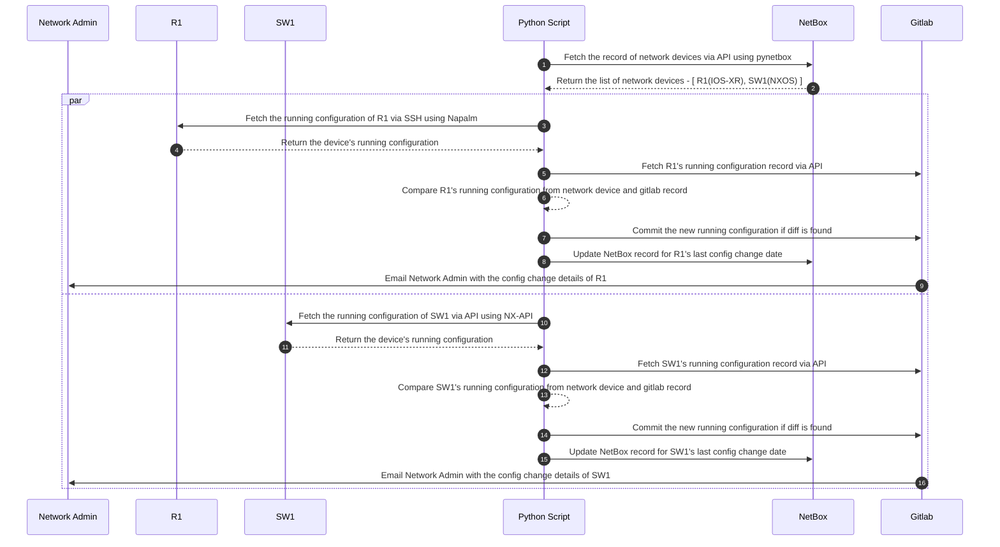

# Logic Flow

Sample logic flow for simulated environment with R1 and SW1 as managed network devices.

<figure markdown>
  { width="450" }
  <figcaption>Sample Diagram</figcaption>
</figure>

``` mermaid
sequenceDiagram
  participant Network Admin
  participant R1
  participant SW1
  participant Python Script
  participant NetBox
  participant Gitlab
  autonumber
  Python Script->>NetBox: Fetch the record of network devices via API using pynetbox
  NetBox-->>Python Script: Return the list of network devices - [ R1(IOS-XR), SW1(NXOS) ]
  par
    Python Script->>R1: Fetch the running configuration of R1 via SSH using Napalm
    R1-->>Python Script: Return the device's running configuration
    Python Script->>Gitlab: Fetch R1's running configuration record via API
    Python Script-->>Python Script: Compare R1's running configuration from network device and gitlab record
    Python Script->>Gitlab: Commit the new running configuration if diff is found
    Python Script->>NetBox: Update NetBox record for R1's last config change date
    Gitlab->>Network Admin: Email Network Admin with the config change details of R1
  and
    Python Script->>SW1: Fetch the running configuration of SW1 via API using NX-API
    SW1-->>Python Script: Return the device's running configuration
    Python Script->>Gitlab: Fetch SW1's running configuration record via API
    Python Script-->>Python Script: Compare SW1's running configuration from network device and gitlab record
    Python Script->>Gitlab: Commit the new running configuration if diff is found
    Python Script->>NetBox: Update NetBox record for SW1's last config change date
    Gitlab->>Network Admin: Email Network Admin with the config change details of SW1
  end
```